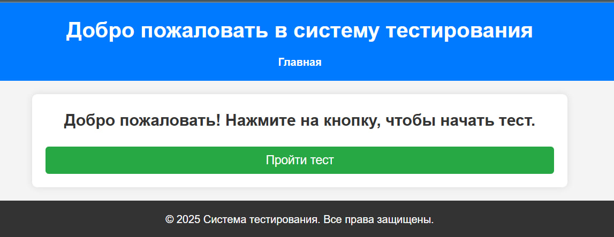
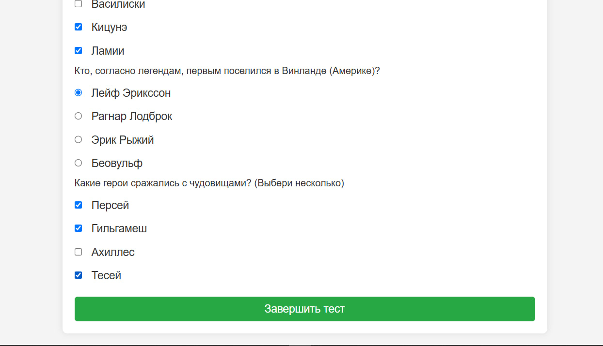
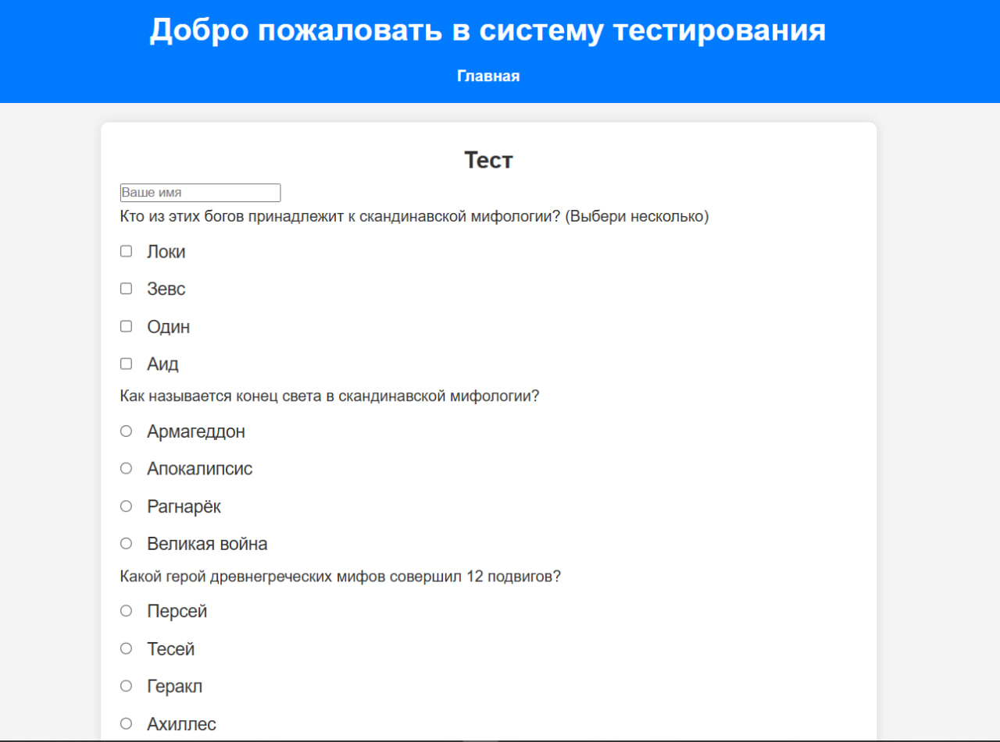
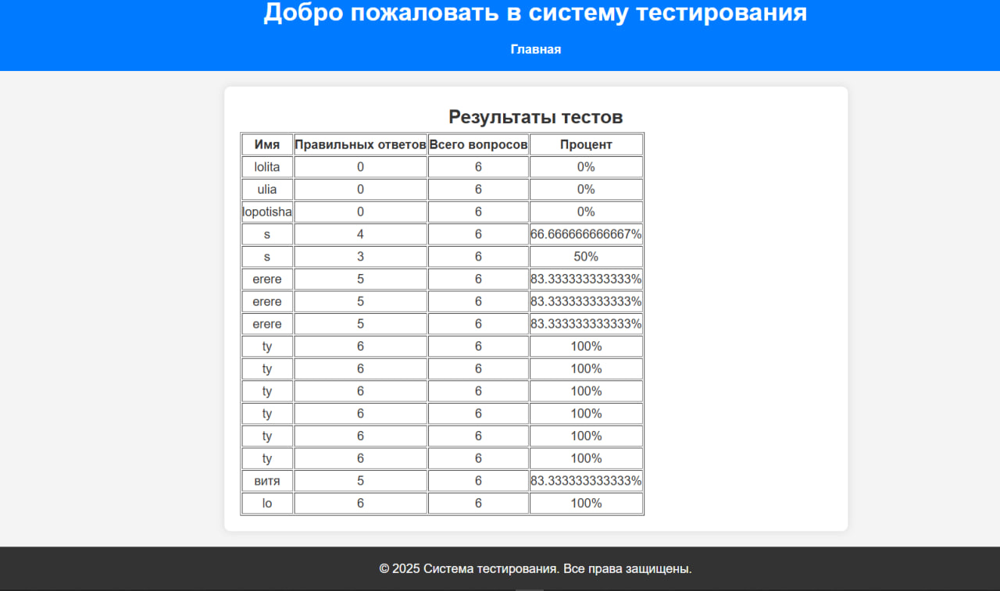

# Альтернативная работа №1
## Вебприложение для прохождения теста

### Краткое описание функционала приложения

- Главная страница с приветствием и кнопкой для начала теста.
- Страница теста с вопросами и вариантами ответов.
- Возможность выбора одного или нескольких вариантов ответа в зависимости от типа вопроса.
- Сохранение результатов теста в файл `results.json`.
- Страница с отображением результатов пользователя.

```
/alternative/           # Корневая папка проекта
│── /css/               # Стили проекта
|   │── styles.css
│── /data/              # Хранилище данных
│   ├── questions.json  # Файл с тестами (JSON)
│   ├── results.json    # Файл для хранения результатов тестов (JSON)
│── /inc/               # Вспомогательные файлы (функции)
│   ├── config.php      # Конфигурация проекта
│   ├── functions.php   # Функции для работы с JSON и обработка теста
│── /templates/         # HTML-шаблоны
│   ├── header.php      # Заголовок (общий для всех страниц)
│   ├── footer.php      # Подвал (общий для всех страниц)
│── index.php           # Главная страница (кнопка "Пройти тест")
│── test.php            # Страница теста
│── dashboard.php       # Страница с результатами тестирования
│── styles.css          
```

### Примеры тестов

Пример вопроса с одним правильным ответом:
- Вопрос: "Как называется конец света в скандинавской мифологии?"
- Варианты ответов: "Армагеддон", "Апокалипсис", "Рагнарёк", "Великая война"
- Правильный ответ: "Рагнарёк"

Пример вопроса с несколькими правильными ответами:
- Вопрос: "Кто из этих богов принадлежит к скандинавской мифологии? (Выбери несколько)"
- Варианты ответов: "Локи", "Зевс", "Один", "Аид"
- Правильные ответы: "Локи", "Один"

### Структура базы данных или файла

Файл `questions.json` содержит вопросы и правильные ответы:
```json
[
    {
        "question": "Кто из этих богов принадлежит к скандинавской мифологии? (Выбери несколько)",
        "type": "checkbox",
        "options": ["Локи", "Зевс", "Один", "Аид"],
        "answer": ["Локи", "Один"]
    },
    ...
]
```

### Файл results.json содержит результаты тестов пользователя:
```json
[
    {
        "name": "lolita",
        "score": 0,
        "total": 6,
        "percentage": 0
    },
    ...
]
```

### Интерфейс
Главная страница


Страница теста



Страница результатов

